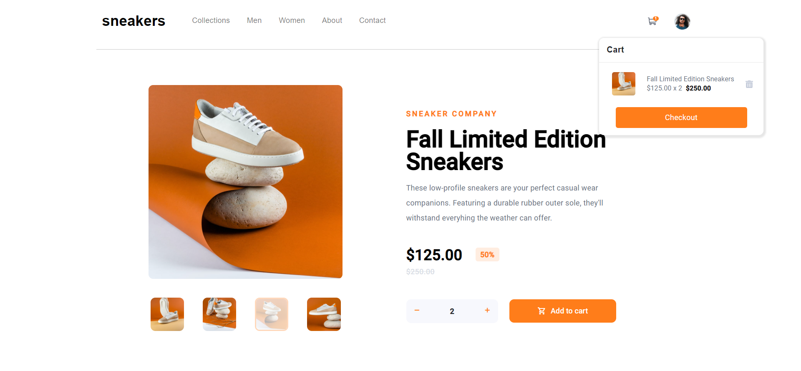

# Frontend Mentor - E-commerce product page solution

This is a solution to the [E-commerce product page challenge on Frontend Mentor](https://www.frontendmentor.io/challenges/ecommerce-product-page-UPsZ9MJp6). Frontend Mentor challenges help you improve your coding skills by building realistic projects.

## Table of contents

- [Overview](#overview)
  - [The challenge](#the-challenge)
  - [Screenshot](#screenshot)
  - [Links](#links)
- [My process](#my-process)
  - [Built with](#built-with)
  - [What I learned](#what-i-learned)
  - [Continued development](#continued-development)
  - [Useful resources](#useful-resources)
- [Author](#author)
- [Acknowledgments](#acknowledgments)

## Overview

### The challenge

Users should be able to:

- View the optimal layout for the site depending on their device's screen size
- See hover states for all interactive elements on the page
- Open a lightbox gallery by clicking on the large product image
- Switch the large product image by clicking on the small thumbnail images
- Add items to the cart
- View the cart and remove items from it

### Screenshot



### Links

- Solution URL: [Add solution URL here](https://github.com/KarimAyman97/ECommerceProductPage)

## My process

### Built with

- Semantic HTML5 markup
- CSS custom properties
- Flexbox
- [Angular](https://angular.io/) - Angular framework
- [Bootstrap](https://getbootstrap.com/) - Bootstrap

### What I learned

I learned alot doing this challenge, Its my first time to make carousel with thumbnails also the lighter Images appear on clicking images , and i learned how to use subjects in angular.

To see how you can add code snippets, see below:

```html
<div class="col-md-6 d-none d-md-block">
  <div
    id="custCarousel"
    class="carousel slide"
    data-bs-ride="carousel"
    align="center"
  >
    <!-- slides -->
    <div class="carousel-inner" (click)="showZoomed()">
      <div class="carousel-item active">
        
      </div>
      <div class="carousel-item">
        
      </div>
      <div class="carousel-item">
        
      </div>
      <div class="carousel-item">
        
      </div>
    </div>

    <!-- Thumbnails -->
    <ol class="carousel-indicators ">
      <li class="list-inline-item active">
        <a
          id="carousel-selector-0"
          data-bs-slide-to="0"
          data-bs-target="#custCarousel"
        >
          
        </a>
      </li>

      <li class="list-inline-item">
        <a
          id="carousel-selector-1 "
          data-bs-slide-to="1"
          data-bs-target="#custCarousel"
        >
          
        </a>
      </li>

      <li class="list-inline-item">
        <a
          id="carousel-selector-2"
          data-bs-slide-to="2"
          data-bs-target="#custCarousel"
        >
          
        </a>
      </li>

      <li class="list-inline-item">
        <a
          id="carousel-selector-2"
          data-bs-slide-to="3"
          data-bs-target="#custCarousel"
        >
          
        </a>
      </li>
    </ol>
  </div>
</div>
```

```scss
#Zoomer {
  position: absolute;
  top: 0;
  left: 0;
  width: 100%;
  height: 100%;
  z-index: -1;

  .close-button {
    margin: 2% 58%;
    position: absolute;
    left: 2%;
    border: none;
    background: none;
    color: $primary-color;
  }
  .Zoomer-image {
    border-radius: 15px;
    width: 400px;
    height: 380px;
    margin: 7% 37%;
  }
  .thumbnail-block {
    margin: -2% 36%;
  }
}
```

```ts
  addOrReplaceObject(array: ProductModel[], newObject: ProductModel) {
    const index = array.findIndex((obj) => obj.id === newObject.id);
    if (index !== -1) {
      array.splice(index, 1, newObject);
    } else {
      array.push(newObject);
    }
  }
```

### Continued development

i want to keep focusing on carousel and use some another libraries like swiperjs this would make carousel design easier.

### Useful resources

- [resource](https://stackoverflow.com/questions/53487828/rxjs-subject-observable-subscribe-array-of-list) - This helped me doing the service that would use subject to make cart in navbar and product component subscribe on same observable.

## Author

- Website - [Karim Ayman](https://karimayman97.github.io/ECommerceProductPage/ECommerceProductPage/)
- Frontend Mentor - [@KarimAyman97](https://www.frontendmentor.io/profile/KarimAyman97)
- Linkedin - [@yourusername](https://www.linkedin.com/in/karimayman97/)
